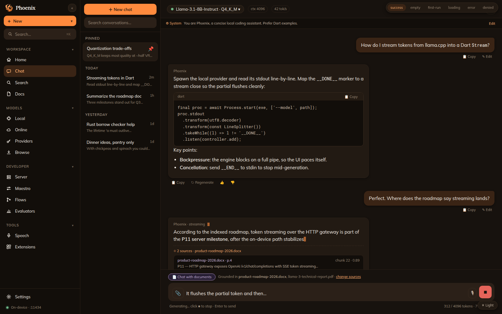
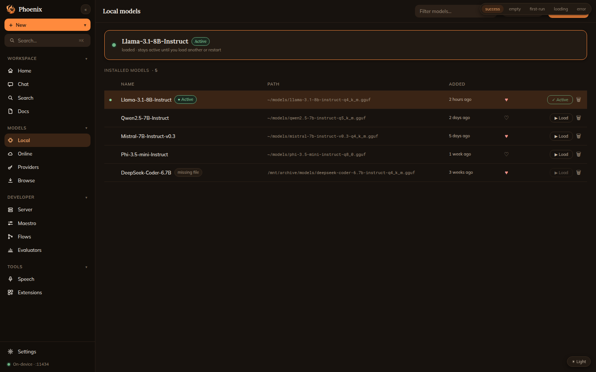

<div align="center">


# Phoenix

### Run large language models **100% on your own machine** — private, offline, yours.

A full-stack, open-source workbench for local LLMs. Flutter desktop UI over a
**llama.cpp** engine, a pure-Dart core SDK, and an optional Django/Celery backend —
no cloud, no API keys, no data leaving your device.

[](https://github.com/osllmai/phoenix/stargazers)
[](LICENSE)
[](https://flutter.dev)
[](https://github.com/ggerganov/llama.cpp)
[](#contributing)

**⭐ If Phoenix is useful to you, [star the repo](https://github.com/osllmai/phoenix) — it genuinely helps.**

</div>

---

<div align="center">


<br/><sub><i>Desktop UI — design preview (the app is in active development).</i></sub>
</div>

## Why Phoenix?

- 🔒 **Truly private** — inference runs on-device in `phoenix_core` + `engine/`. The backend **never** runs an LLM. Your prompts never leave the machine.
- ⚡ **Local-first, cloud-optional** — works fully offline; an optional gateway speaks OpenAI `/v1/chat/completions` + Anthropic `/v1/messages` so existing tools just point at `localhost`.
- 🧩 **Extensible by design** — features load as self-registering modules (`FeatureModule`); add one file, not a monolithic rewrite.
- 📦 **GGUF model catalog** — import `.gguf` files from disk, load/switch/remove, favorites — all managed on-device.
- 🛠️ **One core, many surfaces** — a single pure-Dart SDK powers the Flutter app, an HTTP gateway, and a CLI.

## Features

| | |
|---|---|
| 💬 **Chat** | Streaming local inference with system prompts + tunable sampling. |
| 🧠 **Local models** | Add / load / switch / remove GGUF models; pick your active model. |
| 📄 **Documents & search** | Doc-convert (Docling) + retrieval for chat-with-your-files *(in progress)*. |
| 🎙️ **Speech** | On-device transcription via whisper.cpp *(planned)*. |
| 🔌 **OpenAI/Anthropic gateway** | Drop-in local endpoint for existing clients *(WIP)*. |
| 🧱 **Extensions** | Install capabilities on demand — keep the core lightweight. |

## Quick start

### Install (Cursor-style)

```bash
# Same pattern as: curl https://cursor.com/install -fsS | bash
curl -fsSL https://raw.githubusercontent.com/osllmai/phoenix/production/install/install | bash

# CLI only
curl -fsSL https://raw.githubusercontent.com/osllmai/phoenix/production/install/install | bash -s -- --cli

# Desktop only
curl -fsSL https://raw.githubusercontent.com/osllmai/phoenix/production/install/install | bash -s -- --desktop
```

**Production URL (when you host it):** point `https://get.phoenix.example/install` at the same
file — e.g. nginx static, Cloudflare, or GitHub Pages — so users get a short link like Cursor.

Requires a [GitHub Release](https://github.com/osllmai/phoenix/releases) with platform artifacts
(built by `.github/workflows/release_binaries.yml` on each `v*` tag).

Alternative (Python): `curl -fsSL …/install.py | python3 -`

**Local gateway + curl (from source or after `phoenix` CLI install):**

```bash
# 1. Start gateway (default :24678)
cd packages/phoenix_server && dart run bin/server.dart

# 2. Register + load a GGUF
curl -X POST http://127.0.0.1:24678/v1/models \
  -H 'Content-Type: application/json' \
  -d '{"name":"Llama-3","path":"/path/to/model.gguf"}'
curl -X POST http://127.0.0.1:24678/v1/models/1/select

# 3. Chat (OpenAI-compatible)
curl http://127.0.0.1:24678/v1/chat/completions \
  -H 'Content-Type: application/json' \
  -d '{"messages":[{"role":"user","content":"Hello"}]}'

# 4. Claude CLI / Anthropic clients (or: phoenix configure --all)
python3 install/phoenix_cli.py configure --all
source ~/.phoenix/env.sh
phoenix    # start gateway in another terminal, load a model, then: claude
```

### Develop from source

```bash
# Desktop app (Flutter)
cd mobile && flutter pub get && flutter run -d linux   # or -d macos / -d windows

# Core + app tests (pure Dart)
bash mobile/tool/run_tests.sh

# Optional backend + web (Docker)
cp .env.example .env && make up                        # api :16000 · web :3000
```

> **Inference is on-device.** Point Phoenix at a `.gguf` you already have, or grab one
> from Hugging Face, and start chatting — no account, no network required.

## Architecture

| Path | What |
|------|------|
| `mobile/` | Flutter app (desktop-first). UI only — no business logic. |
| `packages/phoenix_core/` | Pure-Dart SDK: engine + chat/model services + SQLite + `PhoenixCore` facade. |
| `packages/phoenix_server/` | OpenAI/Anthropic-compatible HTTP gateway over the core *(WIP)*. |
| `backend/` | Django + django-ninja + Celery — auth, sync, async jobs (deep-search, Docling, embeddings). |
| `frontend/` | Next.js 15 web surface (optional). |
| `engine/local_provider/` | Vendored llama.cpp / gpt4all engine binary. |
| `install/` | Python installer, release build, e2e smoke, `verify.py` |
| `docs/AUDIT.md` | External audit checklist (for reviewers) |
| `design/` | Scenarios, integration plans, `MONOREPO.md`, `TRACKER.md`. |
| `docker/` · `docs/adr/` | Infra and architecture decisions. |

See [`design/MONOREPO.md`](design/MONOREPO.md) for the full architecture and
[`design/TRACKER.md`](design/TRACKER.md) for build status.

## Principle

**Inference is on-device** (`phoenix_core` + `engine/`). The backend never runs an
LLM. Features load as self-registering modules (`FeatureModule`) so the app scales
without a monolithic shell.

## Acknowledgements

[llama.cpp](https://github.com/ggerganov/llama.cpp) ·
[gpt4all](https://github.com/nomic-ai/gpt4all) ·
[Docling](https://github.com/docling-project/docling) ·
[whisper.cpp](https://github.com/ggerganov/whisper.cpp)

## License

Phoenix is licensed under the [GNU Affero General Public License v3.0](LICENSE).

Copyright © 2023–2026 **NEMATI AI LLC** — a Wisconsin limited liability company
(Entity ID D075329), 7343 N Teutonia Ave, Apt 7, Milwaukee, WI 53209-2051, USA.
See [`NOTICE`](NOTICE) for details.

<div align="center"><sub>Built with 🔥 by NEMATI AI LLC and the osllmai community — <a href="https://github.com/osllmai/phoenix">star us on GitHub</a>.</sub></div>
